# Perplexity发布Deep Research:让AI帮你做几小时的深度研究

你有没有遇到过这样的场景:需要写一份行业分析报告,得翻几十个网站、看上百篇文章,光是整理信息就要花大半天。或者准备投资决策时,要对比各种财务数据和市场动态,累得够呛还担心漏掉关键信息。现在Perplexity推出的Deep Research功能,就是专门来解决这个痛点的——它能在2-4分钟内完成人类专家需要数小时才能做完的深度研究工作。

---

## Deep Research是什么?

简单说,就是Perplexity的"深度研究模式"。你提一个问题,它会自动执行几十次搜索、阅读几百份资料,然后像人类研究员那样思考、推理,最后生成一份完整的研究报告。

这不是简单的信息堆砌。它真的会"思考"——边搜索边调整研究方向,发现新线索就继续深挖,就像你自己做研究时的那个过程。

### 具体怎么用?

1. 打开perplexity.ai
2. 在搜索框选择"Deep Research"模式
3. 输入你的问题
4. 等2-4分钟,报告就出来了
5. 可以导出PDF或转成Perplexity Page分享

重点是:**所有人都能免费用**。Pro订阅用户可以无限次使用,免费用户每天也有一定次数。目前网页版已上线,iOS、Android和Mac版本也快了。

---

## 它是怎么工作的?

整个过程分三步:

**第一步:带推理的研究**

这一步最关键。Deep Research不是无脑搜索,而是会"想"——搜到一批资料后,它会分析这些信息,判断接下来该往哪个方向查,然后继续搜。这个循环会重复很多次,直到把主题研究透。

就像你研究一个新领域时,一开始只有模糊概念,查着查着逐渐理解了全貌,知道该重点关注什么——AI现在也能这么做了。

**第二步:写报告**

资料收集完,它会把所有信息整合成一份清晰、全面的报告。不是简单复制粘贴,而是真正的综合分析。

**第三步:导出和分享**

报告可以导出成PDF或文档,也可以转成Perplexity Page发给同事朋友。这个功能对需要协作的团队来说挺实用。

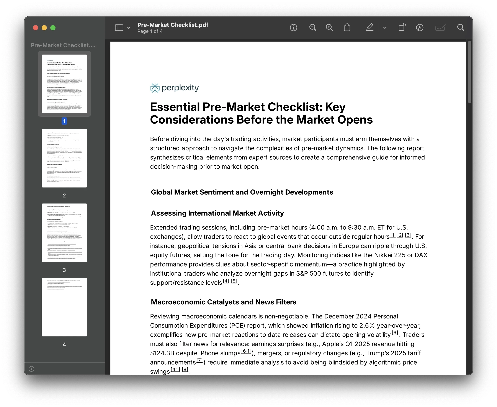

---

## 什么时候该用Deep Research?

Perplexity的定位很明确:让每个人都能做专家级分析。不管你是金融从业者、营销人员,还是普通用户想研究健康、选购产品、规划旅行,Deep Research都能帮上忙。

如果你想更高效地使用这类AI工具,并获得稳定的Pro账号服务, 👉 [现在就获取Perplexity Pro年费成品号,24小时自动发货,365天质保无忧!](https://shaoyumi.com/buy/64) 省去注册和订阅的麻烦,直接开始你的深度研究之旅。

下面是一些实际应用场景:

### 金融分析

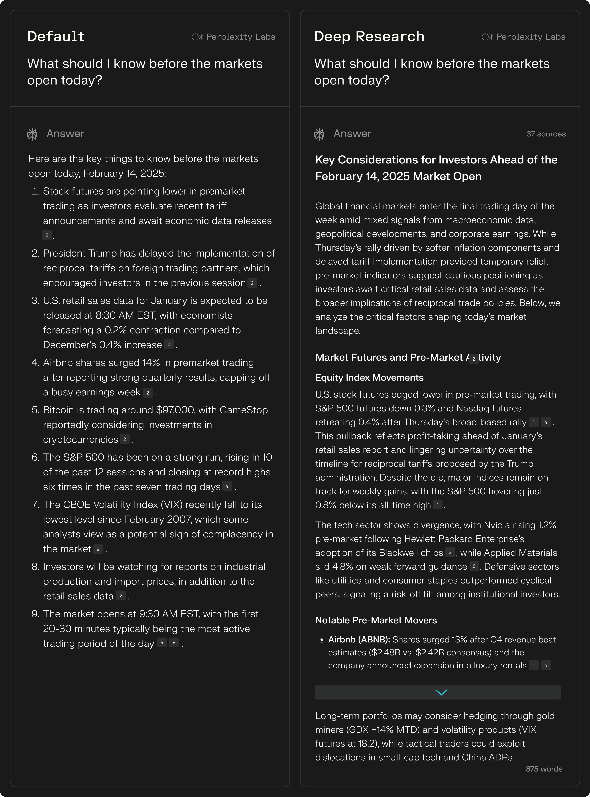

比如你想了解某个行业的投资机会,需要分析市场趋势、竞争格局、财务指标等。以前得自己翻研报、查数据,现在直接问Deep Research,它会给你一份结构化的分析报告。

### 营销策划

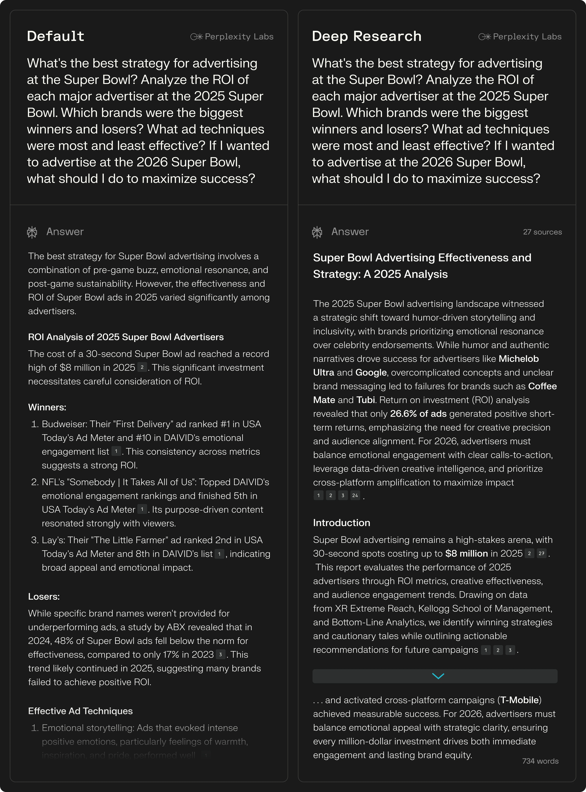

做营销方案前需要研究竞品、用户画像、渠道策略。Deep Research可以帮你快速梳理这些信息,省下大量前期调研时间。

### 技术选型

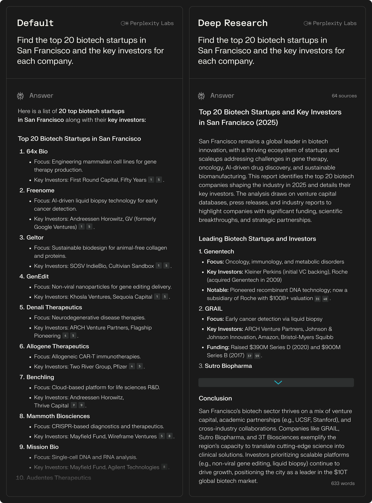

技术团队选框架、工具时,需要对比性能、生态、成本等。让Deep Research做个全面调研,能避免踩坑。

### 时事分析

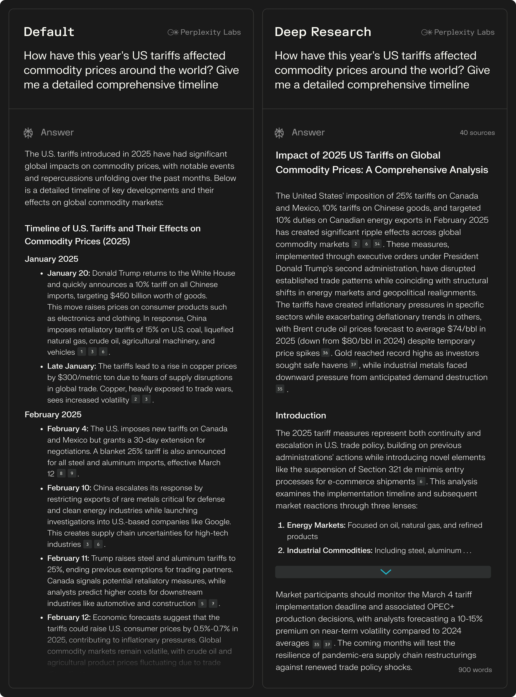

想深入了解某个新闻事件的来龙去脉和各方观点,Deep Research会帮你整理时间线和关键信息点。

### 健康咨询

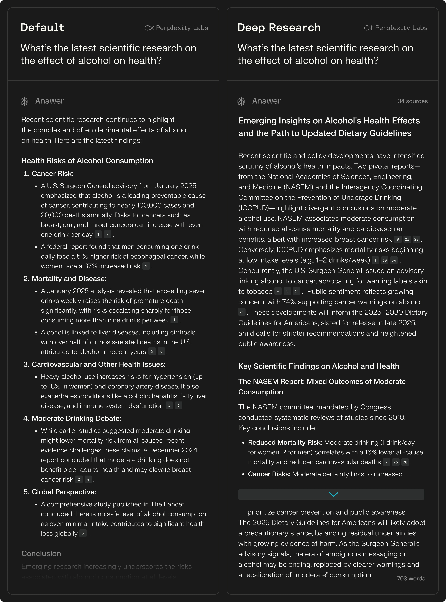

研究某种疾病的治疗方案、药物副作用等,需要查阅大量医学资料。Deep Research可以提供有据可查的信息汇总(当然,具体治疗还是要听医生的)。

### 人物传记

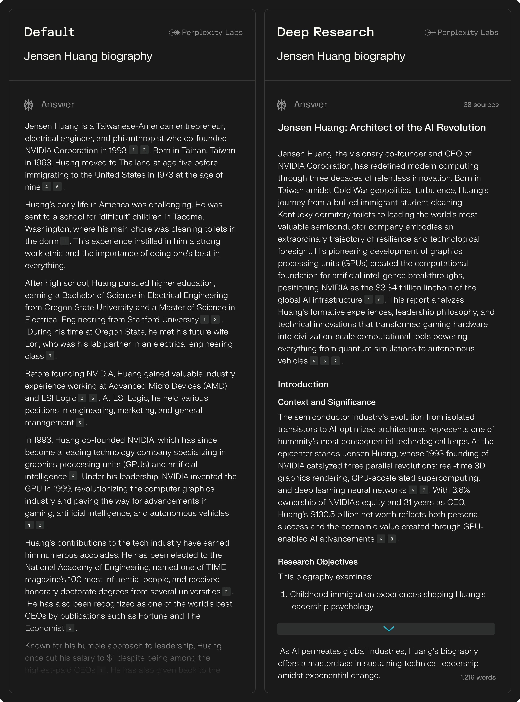

想了解某个历史人物或当代名人的生平,Deep Research会整理出详细的时间线和关键事件。

### 旅行规划

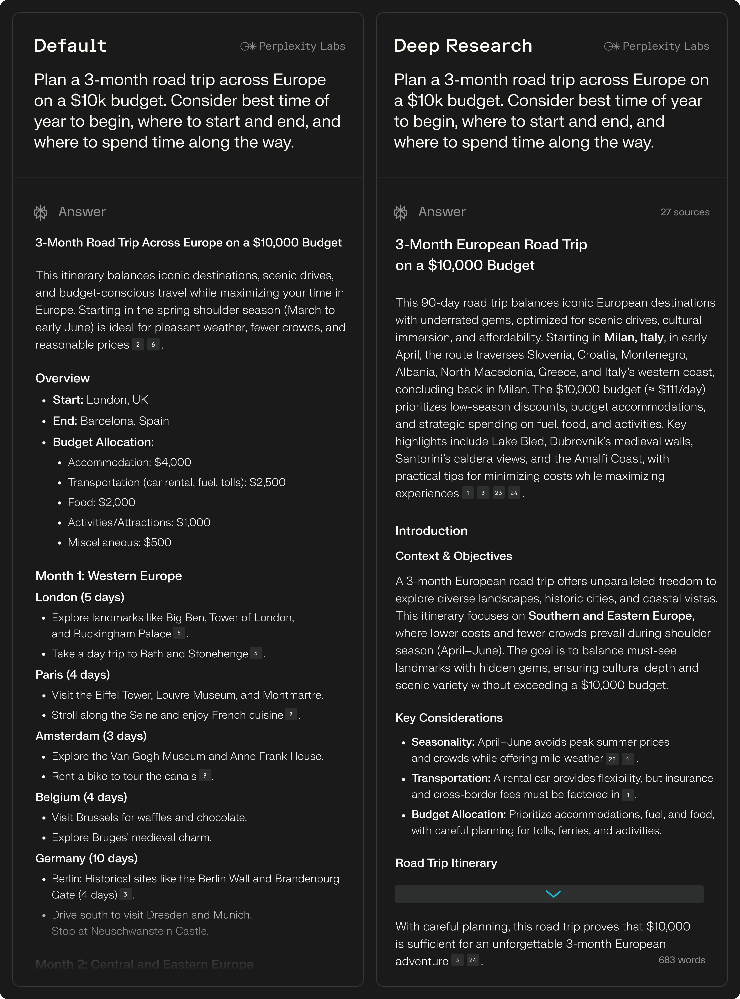

计划去某个地方旅游,想知道最佳季节、必去景点、美食推荐、交通攻略等,一次性搞定。

---

## 性能表现如何?

Perplexity给出了几个测试数据:

**Humanity's Last Exam测试**

这是一个包含3000多道题、覆盖100多个学科的综合性AI测试。Deep Research拿到了21.1%的准确率,超过了Gemini Thinking、o3-mini、o1、DeepSeek-R1等一众模型。

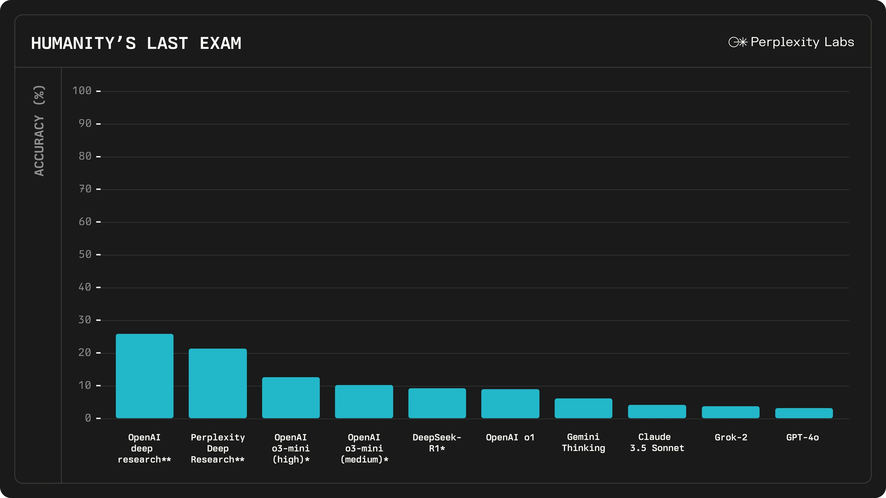

**SimpleQA测试**

这个测试专门检验AI回答的准确性。Deep Research在这个测试中拿到93.9%的准确率,远超其他主流模型。

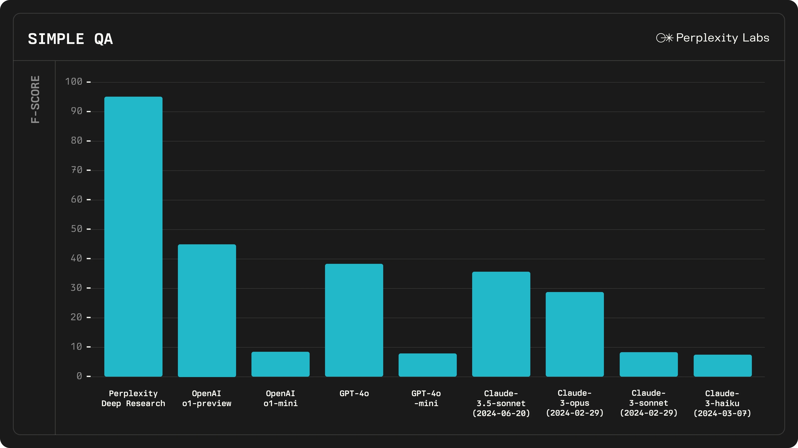

**运行时间**

大部分研究任务能在3分钟内完成。考虑到它做的工作量,这个速度已经相当惊人。Perplexity表示未来还会继续优化,让速度更快。

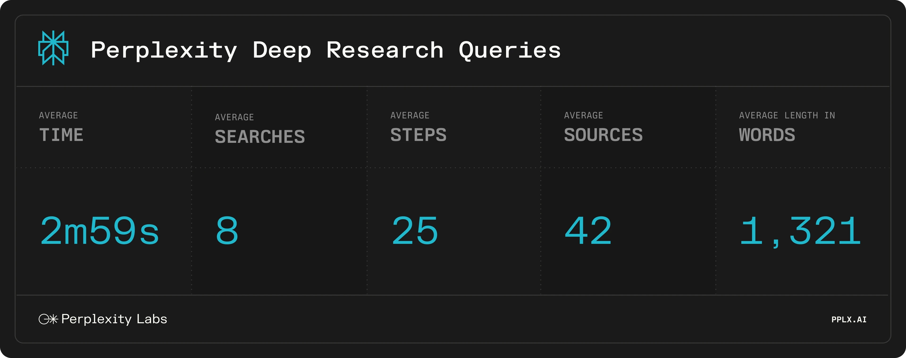

---

## 总结

Deep Research本质上是把"深度研究"这件事自动化了。它不是取代人类思考,而是帮你省掉那些机械的、重复的信息收集工作,让你能把精力放在更重要的决策和创造上。

对于需要频繁做行业研究、市场分析、技术调研的人来说,这个工具能大幅提升工作效率。即便是普通用户,在做重要决策前(比如选产品、查健康信息、规划旅行)用它做个全面调研,也能让决策更有底气。

现在去perplexity.ai就能试用,Pro用户可以无限次使用。如果你经常需要做深度研究,不妨试试这个新功能——毕竟能把几小时的工作压缩到几分钟,这事儿本身就挺值得体验的。 👉 [立即获取Perplexity Pro年费成品号](https://shaoyumi.com/buy/64),享受更稳定高效的深度研究体验,全年无忧使用。
